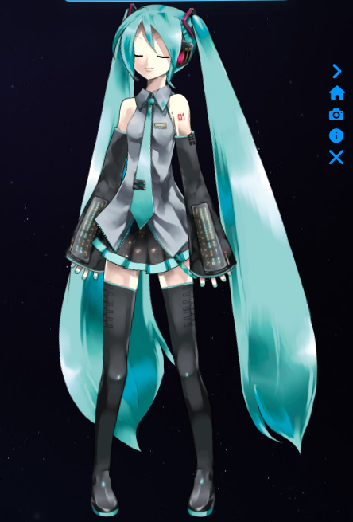
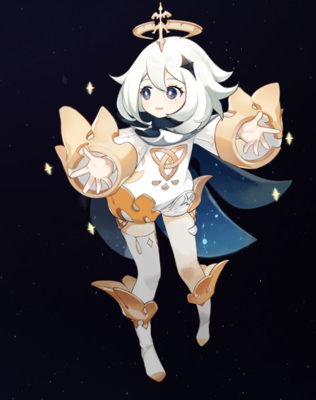
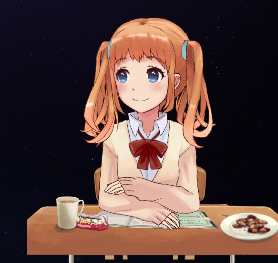

# Live2D Project
This is my first project using Live2D Models based on Cubism SDK 2.1 and Cubism SDK 4, which supports all live2d model including model3

https://makeredundant.github.io/Live2D_demo  


## 📓 Table of Contents
- [Live2D Project](#live2d-project)
  - [� Table of Contents](#-table-of-contents)
  - [💡🏡 Lighthouse](#-lighthouse)
  - [📄 Description](#-description)
  - [🪛 Technologies used](#-technologies-used)
  - [🖥️ Installation](#️-installation)
  - [💬 Usage](#-usage)
  - [🖼️ Screenshot](#️-screenshot)
  - [📹 Video](#-video)
  - [⚖️ License](#️-license)
  - [🤝 Contributing](#-contributing)
  - [🛠️ Tests](#️-tests)
  - [❔ Questions](#-questions)

## 💡🏡 Lighthouse
This is the Lighthouse Google report showcasing Performance 🚀, Accessibility ♿️, Best practices ✅, and SEO 🔍.


## 📄 Description 
Live2D models are animated 2D characters created using Live2D Cubism, a technology that allows artists to create dynamic animations from 2D illustrations. 

Model Creation: Artists create Live2D models using software like Live2D Cubism Editor. They draw and rig 2D artwork in layers, defining movement, expressions, and deformations.

Rigging and Parameterization: Artists use the Cubism Editor to set up parameters (such as eye blinking, facial expressions, etc.) and rig the model with bones and deformers to enable animation.

Animation Control: Live2D models are animated by manipulating the parameters created during rigging. Parameters control various aspects like movement, expressions, and interactions.

How Live2D Models Work:
Rendering: The SDK provides functionalities to render the Live2D models onto different platforms, like web browsers, mobile apps, games, etc.

Parameter Manipulation: By changing parameters like rotation, position, deformation, etc., the model's movements and expressions are controlled.

Interactivity: Developers can create interactions with the models—such as clicking, dragging, or triggering specific animations based on user input.

Integration: Live2D models can be integrated into various applications using the provided SDKs and APIs, allowing developers to bring these animated characters to life in their projects.

huge credits to Konata09 since it was their starter code that made this possible https://github.com/Konata09/Live2dOnWeb  
stevenjoezhang https://github.com/stevenjoezhang/live2d-widget 

## 🪛 Technologies used

| Technology   | Description                          | Link                                    |
|--------------|--------------------------------------|-----------------------------------------|
| Node.js      | Server-side JavaScript runtime        | [Node.js](https://nodejs.org/)          |
| NPM          | Node.js Package Manager              | [NPM](https://www.npmjs.com/)          |
| Live2d       | Interactive animated characters      | [Live2d](https://www.live2d.com/en/)   |


    
## 🖥️ Installation 

Users can run ```npm clone``` and beginning using the application. 

No backend is required
  
## 💬 Usage 
Put each model in a separate folder.
Cubism 2 model's entry file should be named ```model.json```  
Cubism 3/4 model's entry file should be named ```FolderName.model3.json.```

```dist/live2d_bundle.js``` is core file.
```waifu-tips.js``` contains configuration and implementation of message tips.
```waifu-tips.json``` contains content of message tips. Not required if you don't need message tips.


## 🖼️ Screenshot
Homepage


Models included:

Bronya  
  


Miku  



Paimon  



Shizuku  



Rice  


## 📹 Video
Gif of Web application

  
## ⚖️ License 
This project is licensed under MIT
  
## 🤝 Contributing 
Brian Trang
With thanks to Konata09
  
## 🛠️ Tests
N/A
 
## ❔ Questions
If you have any questions about this project, please contact me directly at brian.trang9@gmail.com. Feel free to view more of my projects at https://github.com/Makeredundant.